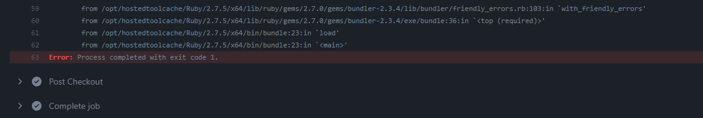
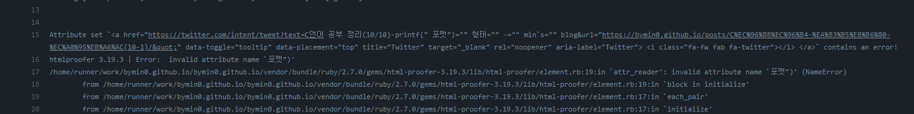
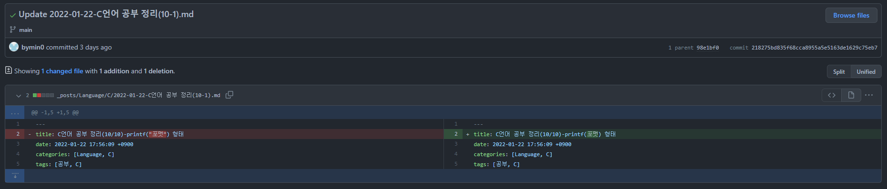
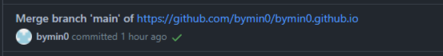
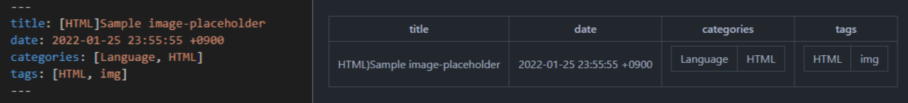
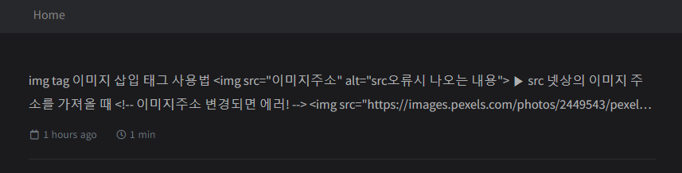
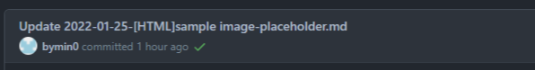
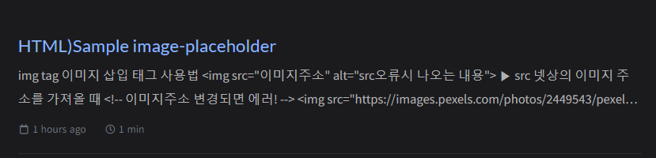

#  Error: Process completed with exit code 1.
포스팅 열심히 써서 commit 했는데 처음으로 오류가 났다. 

 
인터넷에 찾아봤지만 못 찾았다. ~~영어해석에 실패해서 못 찾았다~~ 
 
당황스러웠지만 혹시 몰라 에러 메세지의 맨 윗부분을 읽어보았다. 

 
에러가 난 부분 : `★invalid attribute name "포맷"★` 
 

아.. 큰따옴표("")가 포스팅 제목으로는 사용불가 문자였다. 
 

포스팅 제목의 큰따옴표를 지우고 다시 commit 했더니 포스팅 성공! 

 

# 포스팅 타이틀에 '[ ]'사용
에러는 나지 않았지만 commit이 이상했다. 

 

브랜치를 만든 적도, 병합한 적도 없는데? 

혹시나 하고 포스팅을 확인해보니, 정상적으로 완료된 포스팅과 다른 점이 있었다. 
 
좌: 잘못된 포스팅 우: 정상적으로 완료된 포스팅 

카테고리와 태그에 [ ]형식이 쓰이는데, 혹시 이것때문에 얘가 잘못 인식한건가 싶었다. 

블로그에 들어가보니 글은 올라왔지만 포스팅 제목이 없었다. 
{: width="400"}
 

예상이 맞는지 확인하기 위해 포스팅 타이틀에 [ ]를 지웠다. 

 
업데이트 제대로 완료! 

 

블로그도 제목 제대로 입력 완료! 
{: width="400"}

 
+ 22.05.29 추가

# 특수문자'<>' 오류
- html의 태그를 나타내기위해 사용되는 '\<\>'기호를 특수문자가 아닌 그냥 사용하려고 했었으나 오류가 났다.
- \<강조표시를 위해 사용한 기호\> \>> error!
- \\<사용하는 법\\\> 특수문자 `\` 사용하기!