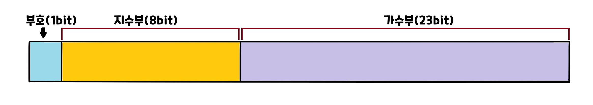

# 1. 배열
- 선언&초기화!
  ```c
  int numArr[5] = {23, 6, 99, 143, 40};
  ```
- 출력!
  ```c
  printf("%d\n", numArr[0]); // numArr의 첫번째 값 출력
  printf("%d\n", numArr[4]); // numArr의 5번째 값 출력
  printf("%d\n", numArr[2]); // numArr의 3번째 값 출력
  // \n : 줄바꿈 표시(enter)
  ```
  결과<br>
  23<br>
  40<br>
  99
- '0'부터 index 시작
- 배열 초기화시 크기보다 값 개수가 적은것은 괜찮으나 넘으면 에러!

# 2. '문자' / "문자열"
- 하나의 문자를 표현 할 때는 `''`
- 둘 이상의 문자**열**을 표현 할 때는 `""`
- 문자
  - '1' = '1'
  - 'T' = 'T'
- 문자열
  - "32" = '3' '2'
  - "web" = 'w' 'e' 'b'
- 하나의 '문자'를 "문자열"로 하는것은 가능
  - "x" = 'x' '\0' &nbsp;&nbsp; // '\0' → Null

# 3. printf()
- C언어의 출력함수
- 여러 종류의 데이터 포맷으로 출력할 수 있다.
  ```c
  printf("%d\n",65.3); // %d : int
  printf("%f\n",65.3); // %f : float, double
  printf("%c\n",65); // %c : char
  printf("Hello, World!");
  ```
  **결과**<br>
  65<br>
  65.3<br>
  A<br>
  Hello, World!

# 4. 이진법 음수표현
## 1) 부호와 절대치
- 비트의 첫 번째가 0이면 양수, 1이면 음수
- int 10; >> <u>__0__</u>000 ···00 1010
- int -10; >> <u>__1__</u>000 ···00 1010

## 2) 1의 보수
- 0 → 1
- 1 → 0<br>
  0010 ···11 0110을<br>
  1101 ···00 1001로 변경

## 3) 2의 보수
- `주로 사용하는 방법`
- 1의 보수 + 1
- ex) 0010 ···11 0110<br>
  → 1101 ···00 1001 + 1<br>
  → <u>1101 ···00 1010</u>

# 5. 실수 - 부동소수점
## 1) 실수 표현방식
- 241.857 = 0.241857 x 10<sup>3</sup>
  - 241857 : 가수부
  - 10<sup>3</sup> : 지수부
- 12.45 = 0.1245 x 10<sup>2</sup>
  - 1245 : 가수부
  - 10<sup>2</sup> : 지수부
- 8.72 = 0.872 x 10<sup>1</sup>
  - 872 : 가수부
  - 10<sup>1</sup> : 지수부

## 2) 비트 구조
{: width = "400"}
> <center>(-1)<sup>s</sup> x 2<sup>E</sup> x M</center>
- (-1)<sup>s</sup> : 부호부(+/-) >> 1bit
- 2<sup>E</sup> : 지수부 >> 8bit
- M : 가수부 >> 23bit

### 컴퓨터의 실수 표현방법
&nbsp;&nbsp;&nbsp;&nbsp;&nbsp;&nbsp;&nbsp;`5.25`
1. &nbsp; 5 → 101<sub>(2)</sub>
2. &nbsp; 0.25 → 01<sub>(2)</sub>
3. &nbsp; 5.25 → 101.01<sub>(2)</sub>
4. &nbsp; 101.01<sub>(2)</sub> → 1.0101(가수) x 2<sup>2</sup>(지수)
5. &nbsp; 가수의 좌측 끝은 언제나 1이므로 그 다음부터만 가수부에 저장 → 0101
6. &nbsp; (2<sup>2</sup>의 지수)**2 + 127**(지수부(8bit)의 <sup>*</sup>bias) = 129
7. &nbsp; 지수부에 129 저장 → 1000 0001<sub>(2)</sub>
8. &nbsp; 5.25는 양수이므로 부호부 → 0<br>
  ∴ 5.25 → 0 10000001 01010000000000000000000<sub>(2)</sub><br>
  <sup>*</sup>bias : 2<sup>k-1</sup> - 1 (k=지수부의 비트수)

# 참고자료
## 부동소수점
- [Wikipedia](https://ko.wikipedia.org/wiki/%EB%B6%80%EB%8F%99%EC%86%8C%EC%88%98%EC%A0%90)
- [Codetorial](https://codetorial.net/articles/floating_point.html)