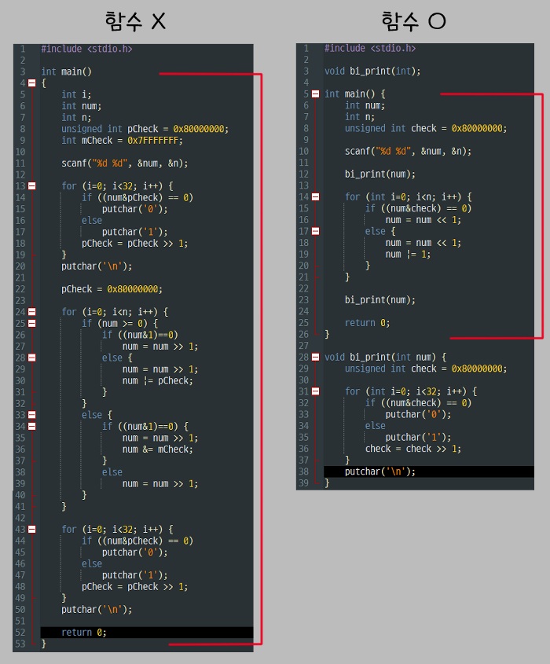
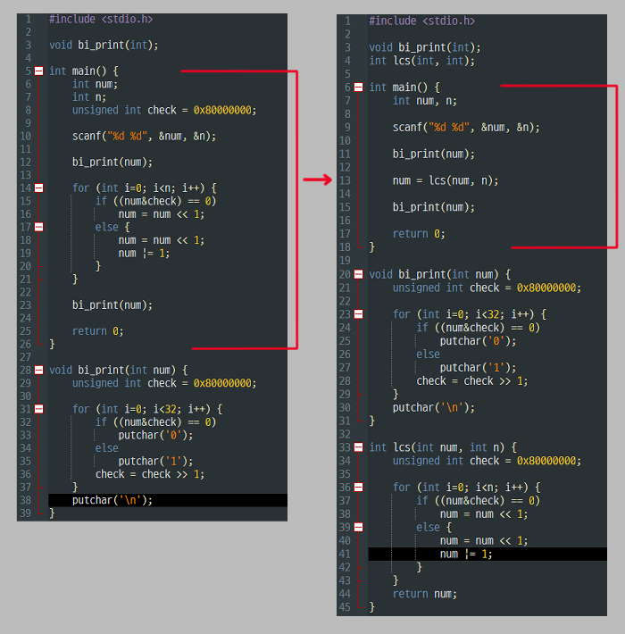

22/01/04
# 1. right circular shift 프로그램
- right circular shift : 주어진 정수의 비트를 오른쪽으로 n번 이동
- ex) 
  - 10 3(입력) → 00000000000000000000000000001010 (원본)<br>
    &nbsp;&nbsp;&nbsp;&nbsp;&nbsp;&nbsp;&nbsp;&nbsp;&nbsp;&nbsp;&nbsp;&nbsp;&nbsp;&nbsp;&nbsp;&nbsp; &nbsp; &nbsp; &nbsp; &nbsp; 01000000000000000000000000000001 (결과)
  - \-10 3(입력) → 11111111111111111111111111110110 (출력)<br>
    &nbsp;&nbsp;&nbsp;&nbsp;&nbsp;&nbsp;&nbsp;&nbsp;&nbsp;&nbsp;&nbsp;&nbsp;&nbsp;&nbsp;&nbsp;&nbsp;&nbsp;&nbsp; &nbsp; &nbsp; &nbsp; &nbsp; 11011111111111111111111111111110 (결과)
- 조건
  - scanf() 사용
  - 원본과 결과 모두 2진수로 출력
  - 오른쪽으로 이동되는 비트가 0이면 0추가, 1이면 1추가
  
```c
#include <stdio.h>

int main() {

    // 변수 선언

    scanf("%d %d", &num, &n);

    // 원본 2진수 출력

    for (i=0; i<n; i++) {

        // right circular shift
    }

    // shift 결과 출력

    return 0;
}
```
<br>
<br>
소스 코드<br>

```c
#include <stdio.h>

int main() {

    int num, n, i;
    unsigned int check = 0x80000000; // 1000...0000
    int rcheck = 0x7FFFFFFF; // 0111...1111

    scanf("%d %d", &num, &n);

    // 원본 2진수 출력
    for (i=0; i<32; i++) {
        if((num&check) == 0)
            putchar('0');
        else
            putchar('1');
        check = check >> 1;
    }
    putchar('\n');

    check = 0x80000000;

    // 1. right circular shift
    for (i=0; i<n; i++) {
        if (num >= 0) { // 2.양수
            if ((num&1) == 0) // 2-1. 끝 비트가 0인가?
                num = num >> 1;
            else { // 2-2. 1인가?
                num = num >> 1;
                num |= check;
            }
        } else { // 3. 음수
            if ((num&1) == 0) {
                num = num >> 1;
                num &=rcheck; // 3-1. 음수에서 rcs 시 0 추가하기
            } else
                num = num >> 1;
        }
    }

    // shift 결과 출력
    for (i=0; i<32; i++) {
        if((num&check) == 0)
            putchar('0');
        else
            putchar('1');
        check = check >> 1;
    }
    putchar('\n');

    return 0;
}
```
1. right circular shift 시 경우의 수
   1. 양수
      - 0000..001<u>0</u> \>\> 1 → <u>0</u>000..0001 : 0이 자연스럽게 추가 됨
      - 0000..000<u>1</u> \>\> 1 → <u>1</u>000..0000 : 1이 추가되어야 함
   2. 음수
      - 1000..000<u>1</u> \>\> 1 → <u>1</u>100..0000 : 1이 자연스럽게 추가 됨
      - 1000..000<u>0</u> \>\> 1 → <u>0</u>100..0000 : 0이 추가되어야 함

2. 양수일 경우
   - 양수의 끝자리 비트가 0인 경우(num&1)
     - 자연스럽게 0이 추가됨으로 shift만 사용
   - 양수의 끝자리 비트가 1인 경우
     - 어떠한 상황에서도 1을 추가해 줘야 한다.**(언제나 T)**
       -  0, 1 → 1
       -  1, 1 → 1
     - 한 가지라도 1(T)이라면 1(T)로 표현하는 `|`로 쉬프트 후 1000..0000 추가

3. 음수일 경우
   - 음수의 끝자리 비트가 0인 경우
     - 어떠한 상황에서도 0을 추가해 줘야 한다.**(언제나 F)**
       - 0, 0 → 0
       - 1, 0 → 0
     - 한 가지라도 0(F)이라면 0(F)으로 표현하는 `&`로 쉬프트 후 0111..1111 추가
   - 음수의 끝자리 비트가 1인 경우(num&1)
     - 자연스럽게 1이 추가됨으로 shift만 사용

실행 순서
1. 양수
- 4 3 입력
- &nbsp;&nbsp;&nbsp; 0000...0<u>100</u>
- & 0000...0001 (check) <br>
  \-\-\-\-\-\-\-\-\-\-\-\-\-\-\-\-\-\-\-<br>
  &nbsp;&nbsp;&nbsp; &nbsp;&nbsp;&nbsp; &nbsp;&nbsp;&nbsp; &nbsp;&nbsp;&nbsp; &nbsp;&nbsp;&nbsp; &nbsp;&nbsp;&nbsp; &nbsp;&nbsp;&nbsp; &nbsp;&nbsp;&nbsp;F
- num \>\> 1
- &nbsp;&nbsp;&nbsp; <u>0</u>000...00<u>10</u>
- & 0000...0001 (check) <br>
  \-\-\-\-\-\-\-\-\-\-\-\-\-\-\-\-\-\-\-<br>
  &nbsp;&nbsp;&nbsp; &nbsp;&nbsp;&nbsp; &nbsp;&nbsp;&nbsp; &nbsp;&nbsp;&nbsp; &nbsp;&nbsp;&nbsp; &nbsp;&nbsp;&nbsp; &nbsp;&nbsp;&nbsp; &nbsp;&nbsp;&nbsp;F
- num \>\> 1
- &nbsp;&nbsp;&nbsp; <u>00</u>00...000<u>1</u>
- & 0000...0001 (check) <br>
  \-\-\-\-\-\-\-\-\-\-\-\-\-\-\-\-\-\-\-<br>
  &nbsp;&nbsp;&nbsp; &nbsp;&nbsp;&nbsp; &nbsp;&nbsp;&nbsp; &nbsp;&nbsp;&nbsp; &nbsp;&nbsp;&nbsp; &nbsp;&nbsp;&nbsp; &nbsp;&nbsp;&nbsp; &nbsp;&nbsp;&nbsp;T
- num \>\> 1
- <u>000</u>0...0000
- num \|= check ( 0000...0000 \| 1000...0000 )
- 결과
  - 00000000000000000000000000000100
  - 10000000000000000000000000000000

2. 음수
- -2 2 입력
- &nbsp;&nbsp;&nbsp; 1111...11<u>10</u>
- & 0000...0001 (check) <br>
  \-\-\-\-\-\-\-\-\-\-\-\-\-\-\-\-\-\-\-<br>
  &nbsp;&nbsp;&nbsp; &nbsp;&nbsp;&nbsp; &nbsp;&nbsp;&nbsp; &nbsp;&nbsp;&nbsp; &nbsp;&nbsp;&nbsp; &nbsp;&nbsp;&nbsp; &nbsp;&nbsp;&nbsp; &nbsp;&nbsp;&nbsp;F
- num \>\> 1
- <u>1</u>111...111<u>1</u>
- num &= rcheck ( 1111...1111 & 0111...1111)
- &nbsp;&nbsp;&nbsp; <u>0</u>111...111<u>1</u>
- & 0000...0001 (check) <br>
  \-\-\-\-\-\-\-\-\-\-\-\-\-\-\-\-\-\-\-<br>
  &nbsp;&nbsp;&nbsp; &nbsp;&nbsp;&nbsp; &nbsp;&nbsp;&nbsp; &nbsp;&nbsp;&nbsp; &nbsp;&nbsp;&nbsp; &nbsp;&nbsp;&nbsp; &nbsp;&nbsp;&nbsp; &nbsp;&nbsp;&nbsp;T
- num \>\> 1
- 결과
  - 11111111111111111111111111111110
  - 10111111111111111111111111111111

# 2. 10진수를 2진수로 변환하는 함수 만들기
- 이전에 연습했던 10진수 → 2진수 프로그램을 함수로 만들고 left circular shift를 실행하시오
- 조건
  - 함수명 : bi_print
  - 리턴타입 : void
  - main에서 scanf()로 정수를 받고 bi_print()로 2진수 출력

```c
#include <stdio.h>

// 함수 선언

int main() {

    // 변수 선언

    scanf("%d n", num, n);

    // 원본 2진법 출력;

    // left circular shift

    // left circular shift 출력;

    return 0;
}

// 함수 정의

```
<br>
<br>
소스 코드

```c
#include <stdio.h>

void bi_print(int); // 함수 선언

int main() {
    int num, n;
    unsigned int check = 0x80000000;

    scanf("%d n", num, n);

    // 원본 2진법 출력;
    bi_print(num);

    // left circular shift
    for (i=0; i< n;i++) {
        if ((num&check)==0) {
            num = num << 1;
        }
        else {
        num = num << 1;
        num |= 1;
        }
    }

    // left circular shift 출력;
    bi_print(num);

    return 0;
}

// 함수 정의
void bi_print(int num) {
    int i;
    unsigned int check = 0x80000000; // main의 check와는 별개의 변수

    for (i=0; i<32; i++) {
        if((num&check) == 0)
            putchar('0');
        else
            putchar('1');
        check = check >> 1;
    }
    putchar('\n');
}
```

## 이전 코드의 main 길이 비교

 {: width = "400"}

# 3. left circular shift 함수 만들기
- 위의 코드에서 left circular shift 코드도 함수로 만드시오
- 조건
  - 함수명 : lcs
  - 리턴타입 : int

소스 코드

```c
#include <stdio.h>

void bi_print(int);
int lcs(int, int); // 함수 선언

int main() {
    int num, n;

    scanf("%d n", num, n);

    // 원본 2진법 출력;
    bi_print(num);

    // left circular shift
    num = lcs(num, n);

    // left circular shift 출력;
    bi_print(num);

    return 0;
}

// 함수 정의
void bi_print(int num) {
    int i;
    unsigned int check = 0x80000000;

    for (i=0; i<32; i++) {
        if((num&check) == 0)
            putchar('0');
        else
            putchar('1');
        check = check >> 1;
    }
    putchar('\n');
}

int lcs(int num, int n) {
    int i;
    unsigned int check = 0x80000000;

    for (i=0; i< n;i++) {
        if ((num&check)==0) {
            num = num << 1;
        }
        else {
        num = num << 1;
        num |= 1;
        }
    }
}
```

## 이전 코드의 main 길이 비교

 {: width = "400"}