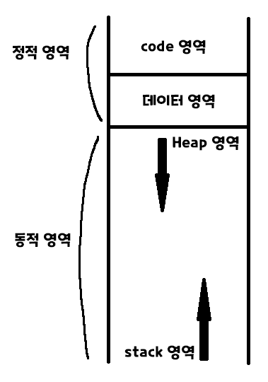

22/01/04
# 1. 외부변수
- 함수 외부에 선언
- 프로그램이 끝날 때 까지 사라지지 않음.

# - 외부변수 종류
## 1. 전역 변수
- 어디서나 어느 파일에서나 사용 가능

- 사용법
  ```c
  int won; // 미초기화시 값 : '\0', 초기화는 한번만

  int main() {}
  ```

- extern
  - 다른 파일 전역변수 사용법
      ```c
      extern int another; // 값 바꾸기 불가. 변수를 불러오기만 하는 것
  
      int main() {}
      ```

  - 함수 또는 블록 내에서 전역변수 사용법
      ```c
      int won; // 함수 위에 선언되어 있어야 한다.
      int main() {
         extern int won; // 값 바꾸기 불가.
      }
      ```

## 2. 정적 외부 변수
- 초기화를 한 번 하면 바뀌지 않음
- 상수(const int MAX = 1000;)처럼 사용됨
- <mark>같은 파일 내</mark>에서만 사용 가능

- 사용법
  ```c
  static int day; // 미초기화시 값 : '\0', 초기화는 한번만

  int main() {}
  ```

# 2. 내부변수
- 함수 또는 블록 내부에 선언
- 변수가 선언된 블록이 실행될 때만 사용

# - 내부변수 종류
## 1. 지역 변수(자동 변수)
- main, function내부에서 선언했던 변수
- 원래는 `auto int x;`이나, auto는 생략하고 `int x;`로 선언된다.
- 사용법
  ```c
  int main() {
     int country; // 미초기화시 값 : 불명, 초기화는 수시로 가능
  }
  ```

## 2. 정적 내부 변수
- 정적 외부 변수가 함수/블록 내부에 선언
- 사용이 끝난 후 사라지는 지역 변수와는 다르게 프로그램이 끝날 때 까지 사라지지 않음.
- 변수가 사라지지는 않지만 속한 블록이 실행되지 않는 한 사용 불가
- 사용법
  ```c
  int main() {
     static int var; // 미초기화시 값 : '\0', 초기화는 한번만
  }
  ```

## 3. 레지스터 변수
- 레지스터에 저장되는 변수
- 속도가 아주 빠르다(단기간에 여러번 사용할 때 유용)
- 변수가 정의된 블록이 끝나면 사라짐

- 사용법
  ```c
  register int x; // 미초기화시 값 : 불명, 초기화는 수시로 가능
  ```

# 3. 메모리 구조
- 프로그램이 실행될 때 마다 생성



## 1. 정적 영역
- 프로그램이 시작될 때 할당됨
- 전역변수, 정적변수(static),함수, 상수 할당
- 초기화값 : 0

## 2. 힙(Heap) 영역
- 컴파일될 때 크기, 주소가 모두 결정

## 3. 스택(Stack) 영역
- 지역변수, 매개변수 할당
- 함수 호출이 완료되면 사라짐 → 지역변수가 속한 곳이 종료되면 수명이 끝나는 이유
- 컴파일 시 주소 저장, 실행(run)될 때 크기 확정

# 4. 임시 변수
- 임시적으로 사용하고 끝나는 변수
- 예시) x, y의 값을 서로 변경하기(x=10, y=20 → x=20, y=10)

   ```c
   int x = 10;
   int y = 20;
   ```

  1. 임시변수 미사용
   ```c
   x = y; // x = 10, y = 10;
   y = x; // y = 10, x = 10;
   ```
   결과: x = 10, y = 10<br>

  2. 임시변수 사용
   ```c
   int temp; // 임시변수
   y = temp; // x = 10, y = 20, temp = 20;
   y = x; // x = 10, y = 10, temp = 20;
   x = temp; // x = 20, y = 10; temp는 필요 x
   ```
   결과 : x = 20, y = 10