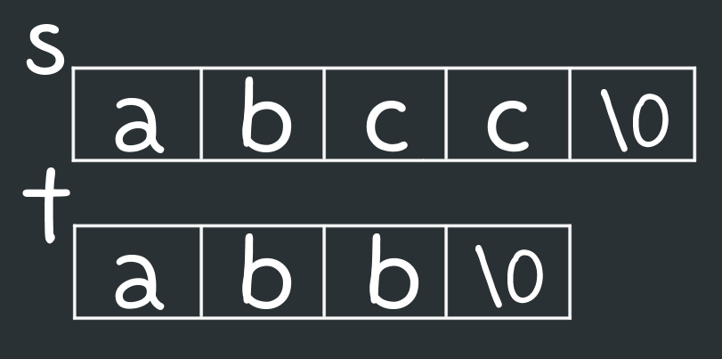
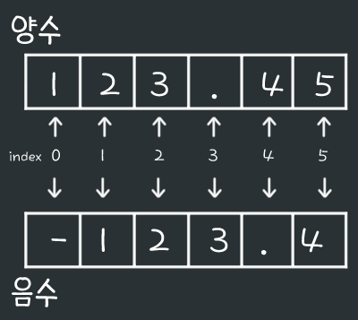

22/01/05
# 1. 주어진 두 문자열의 사전상 순서를 비교해주는 함수 만들기
- \<string.h\>에 있는 함수 strcmp(문자열, 문자열); 만들기
- 사용 예시
  ```c
  strcmp("abc", "abc"); // 문자열이 같을 경우 return 0;
  strcmp("abbd", "fbc"); // a < f 앞의 문자열이 뒤의 문자열보다 작을 경우 return -1;
  strcmp("azc", "aif"); // z > i 앞의 문자열이 뒤의 문자열보다 클 경우 return 1;
  strcmp("abc", "abcd"); // 마지막 문자: '\0', 'd' ∴ "abc" < "abcd" return -1;
  ```

- 조건
  - 함수명 : mystrcmp 

```c
#include <stdio.h>
#include <string.h> // strlen()

// 함수 선언

int main() {
  
  // 변수 선언

  while ((s[i++] = getchar()) != '\n');

  s[i--] = '\0';

  while ((t[j++] = getchar()) != '\n');

  t[j--] = '\0';

  result = mystrcmp(s,t);

  return 0;
}

// 함수 정의
```
<br>
<br>
소스 코드

```c
#include <stdio.h>
#include <string.h>

int mystrcmp(char[], char[]);

int main() {
  
  // 변수 선언
  char s, t;
  int i = 0, j = 0, result;

  while ((s[i++] = getchar()) != '\n'); // abc 입력 시, s = "abc";

  s[i--] = '\0'; // "abc\0" >> 문자열의 끝

  while ((t[j++] = getchar()) != '\n');

  t[j--] = '\0';

  result = mystrcmp(s,t);

  return 0;
}

// 함수 정의
int mystrcmp(char s[], char t[]) {
  int i, len;

  len = strlen(s) > strlen(t) ? strlen(t) : strlen(s); // 1. 삼항연산

  // 2. 문자배열의 값 비교
  for (i=0; i<len; i++) {
    if (s[i] > t[i])
      return 1;
    else if (s[i] < t[i]) {
      return -1;
    }
  }

  // 3. 문자 길이 비교
  if (strlen(s) > strlen(t))
    return 1;
  else if (strlen(s) < strlen(t)
    return -1;
  else
    return 0;
}
```

1. 삼항연산 → 조건 ? 참 : 거짓;
   - 조건이 참일 경우 '참' 실행, 거짓일 경우 '거짓' 실행

2. 문자배열의 값 비교
   - '문자열 s'와 '문자열 t' 중 짧은 길이의 문자열을 `len`의 값으로 설정
   - 앞문자열(s)의 i번째 문자가 뒷문자열(t)의 i번째 문자보다 크다면 1 (s='a''b''c' > a는 0번째)
   - 앞문자열의 i번째 문자가 뒷문자열의 i번째 문자보다 작다면 -1
   - 그렇지 않다면(앞문자`s[i]`와 뒷문자`t[i]`가 같다면) 실행되는 것 없음
   - for문 결과 리턴되는 것이 없다면 종료

3. for문 종료 후 문자열의 길이 비교
   - 'abcd'(길이4), 'abc'(길이3) 문자 비교 결과 'abc'가 같으므로 for문 종료
   - 'abcd', 'abc'의 길이 비교 후 리턴

실행순서
- abcc (입력) -> s배열에 저장
- abb (입력) -> t배열이 저장
{: width = "400"}
- mystrcmp(s,t) 실행
- len = strlen(t) = 3
- for문 : 0 to 2 즉, 3회 실행
- i = 0 \>\> s\[0\] = `'a'`, t\[0\] = `'a'`
- i = 1 \>\> s\[1\] = `'b'`, t\[1\] = `'b'`
- i = 2 \>\> s\[2\] = `'c'`, t\[2\] = `'b'` **// s\[2\] > t\[2\]**
- return 1;
- printf 실행
- 결과 : 1

# 2. 문자열을 실수로 만들어주는 함수 만들기
- \<stdlib.h\>에 있는 함수 atof(문자열); 만들기
- 사용 예시
  ```c
  atof("135.553"); // 135.55300
  // ※실수는 정확도가 떨어지기 때문에 완벽하게 135.553이 안 나올 수 있음
  ```

- 조건
  - 함수명 : myatof
- 힌트
  - 소수점을 기준으로 변수1, 변수2에 저장
  - 변수1, 2의 합을 리턴

```c
#include <stdio.h>
#include <string.h> // strlen()

// 함수 선언

int main() {

  float num;

  char str[80];

  scanf("%s", str);

  num = myatof(str);

  printf("%f\n", num);

  return 0;
}

// 함수 정의
{

  // 변수 선언

  if (str[0] == '-') {
    sign = -1;
    i = 1;
  }

  // 소수점 이상

  // 소수점 이하

  // 소수점 이하 한번 더 나누기

  // 결과 저장

  return num;
}
```
<br>
<br>
소스 코드

```c
#include <stdio.h>
#include <string.h>

int myatof(char[]);

int main() {

  float num;

  char str[80];

  scanf("%s", str);

  num = myatof(str);

  printf("%f\n", num);

  return 0;
}

int myatof(char str[]) {

  int i=0, sign=1; // sign : 부호(+,-)를 위한 변수
  float num, num1=0.0, num2=0.0; // 실수 초기화값은 .0 붙여주는 것이 좋다고..

  if (str[0] == '-') { // 음수일 경우
    sign = -1; // 부호는 '-'
    i = 1; // for문 시작 위치
  }

  // 1. 소수점 이상
  for (; str[i] !='.'; i++)
    num1 = num1 * 10 + str[i] - '0';

  // 2. 소수점 이하
  for (i=strlen(str); i>0; i--)
    num2 = num2 * 0.1 + str[i] - '0';

  // 3. 소수점 이하 한번 더 나누기
  num2 *= 0.1;

  // 4. 결과 저장
  num = sign * (num1 + num2);

  return num;
}
```

0. 부호에 따른 문자열 저장 모양<br>
<br>
- 양수 : index 0부터 숫자 시작
- 음수 : index 1부터 숫자 시작

1. 소수점 이상
- for문 초기화값 : 이미 설정되어 있으면 건너뛸 수 있음
- 문자열\[str\]의 '.'을 만나기 전까지 for문 실행
- '문자'를 숫자로 바꾸기 위해 '숫자형 문자'(ascii code) - '0'(ascii code)
  - '문자'와 '숫자'간의 형변환은 자유로움
  - '1' : ascii code 49
  - '0' : ascii code 48
  - '1' - '0' = 1
- 16진법을 10진법으로 바꾸는 문제 응용
  - `123` \>\> 0 * 10 + 1 \>\> 1 \>\> 1 * 10 + 2 \>\> 12 \>\> 12 * 10 + 3 \>\> 123

2. 소수점 이하
- 문자열의 마지막 index에서부터 거꾸로 for문 시작
- 0.123 : for문의 i값 \>\> 3 , 2 , 1 
- `0.123` \>\> 0 * 0.1 + 3 \>\> 3 \>\> 3 * 0.1 + 2 \>\> 2.3 \>\> 2.3 * 0.1 + 1 \>\> 1.23

3. 소수점 이하 결과 수정
- 소수점 이하의 결과(1.23) = 실제 숫자(0.123) * 10
- 결과값(1.23) * 0.1 = 실제 숫자(0.123)

4. 결과 저장
- 양수인 경우
  - sign : 1
  - sign * (num1 + num2) = num1 + num2
- 음수인 경우
  - sign : -1
  - sign * (num1 + num2) = \- ( num1 + num2)

실행 순서

1. 123.456 (입력)
2. myatof(num) 실행
3. sign = 1, i = 0
4. 소수점 이상
- num1 = 0 * 10 + 1 \>\> 1 * 10 + 2 \>\> 12 * 10 + 3 \>\> 123
5. 소수점 이하
- num2 = 0 * 0.1 + 6 \>\> 6 * 0.1 + 5 \>\> 5.6 * 0.1 + 4 \>\> 4.56
6. 소수점 이하 재계산
- num2 = 4.56 * 0.1 \>\> 0.456
7. 결과 저장
- num = 1 * ( 123 + 0.456 )
8. printf 실행

결과 : 123.456000