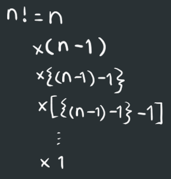
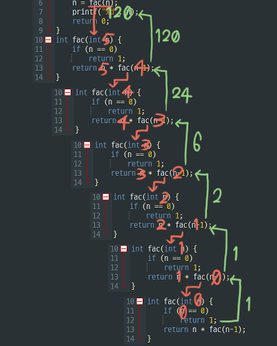

22/01/06
# 1. 재귀함수란
- '나'를 다시 부르는 함수
- ex)
  ```c
  void rec();

  int main() {

    rec();
      
    return 0;
  }

  void rec () {
      printf("rec");
      rec(); // 재귀함수 '나' 안에 '나'를 부름
  }
  ```

- 결과 : recrecrecrecrecrecrecrecrecrecrecrecrecrecrecrecrecrecrecrecrecrecrecrecrecrec......
- 끝없이 호출됨
- 에러! Stack Overflow!

# 2. 재귀함수 조건+(예시 factorial!)
- 재귀함수 사용 시 조건부를 사용해서 빠져나올 수 있게 한다.
- 팩토리얼 재귀함수!
- 팩토리얼의 모양<br>
  

```c
#include <stdio.h>

int factorial(int);

int main() {
    int num;

    scanf("%d", &num);
    num = factorial(num);
    printf("%d", num);

    return 0;
}

int factorial(int num) {
    if(num == 0) // 재귀함수 빠져나올 수 있는 조건
        return 1;
    
    return num * factorial(num - 1);
}
```
num = 5<br>

실행 순서 <br>
<br>
결과 : 120