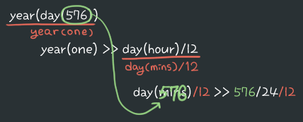

22/01/06
# 1. 전처리기
- 컴파일러에게 특성을 알려주는 키워드
- #include : 어떤 파일을 사용할 것인가?
  - #include \<stdio.h\> : built in function
  - #include "파일명" : 사용자 정의 함수
- #define : 매크로 키워드
- etc..

# 2.  프로그램 실행 순서

```c
int main() {
    func1();
    func2();
}
```

{: width="400"}<br>
- 프로그램이 실행되면 stack에 함수가 호출되고 사용이 완료된 함수는 소멸(stack에서 제거)
- main()은 프로그램의 실행과 끝. main이 종료되면 프로그램도 종료

# 3. 매크로
- 함수는 호출해서 사용하기 때문에 코드는 짧지만 반복되는 횟수가 많아질수록 속도가 떨어질 수 있다.
- 매크로는 컴파일시 매크로를 사용하는 부분에 내용이 치환되어 순서대로 실행되기 때문에 속도는 빨라진다. 대신 메모리는 길어진다.<br>
{: widht="400"}
{: width="400"}<br>

## - 사용법
- 매크로의 이름과 요소의 개수 중요
  ```c
  #define name(param1, param2)  statement
  ```

  - 실행문은 한줄만 번역
  - 여러문장 번역 시 `\`로 다음 줄까지 번역
  ```c
  #define name(param) statement1 \
                      statement2 // 위아래 둘다 번역
  ```

## - 사용시 주의점
- 치환된 매크로의 코드는 `순서대로` 실행되기 때문에 <mark>우선순위를 고려</mark>해야 한다.
- ex) 퍼센트 계산 매크로<br>
```c
#define percent(part, total) (part / total * 100)

int main() {
    printf("%f%%", percent(30 + 30, 300));
}
```

- 치환된 후 코드
  ```c
  printf("%f%%", 30 + 30 / 300 * 100);
  ```

  - 계산 순서 : 30 + 0.1 * 100 \>\> 30 + 10 \>\> 40
  - 결과 : 40%

- 정확한 결과를 만들기 위해 매크로 수정
```c
#define percent(part, total) ((part) / (total) * 100) // part, total 모두 값을 모르므로 ()로 한 묶음임을 표시

int main() {
    printf("%f%%", percent(30 + 30, 300));
}
```

- 치환된 후 코드
  ```c
  printf("%f%%", (30 + 30) / (300) * 100);
  ```

  - 계산 순서 : 60 / 300 * 100 \>\> 0.2 * 100 \>\> 20
  - 결과 : 20%<br>

## - 같은 이름, 다른 인자 개수 
- 알맞은 매크로 사용가능
- ex)
```c
#define sum(x) ((x) + 1)
#define sum(x, y) ((x) + (y))

int main() {
    printf("%d, ", sum(10));
    printf("%d", sum(10, 20));
}
```

결과 : 11, 20<br>

## - 같은 이름, 같은 인자 개수
- 마지막 매크로만 실행
- ex)
```c
#define sum(x) ((x) + 1)
#define sum(n) ((n) + (n))

int main() {
    printf("%d, ", sum(10));
    printf("%d", sum(10));
}
```

결과 : 20, 20<br>

## - 매크로 안의 매크로
```c
#define year(one) (day(hour)/12)
#define day(mins) ((min)/24)

int main() {
    printf("%d", year(day(576)));
}
```
- 함수일 경우 실행 순서
  - year(day(576)) \>\> year(576/24) \>\> year(24) \>\> year(24/12) \>\> 12<br>
  <br>
  - 결과 : 12

- 매크로는 `순서대로` 진행된다.
- 실행 순서
  - year(day(576)) \>\> year(one) \>\> day(hour)/12
  - day(hour)/12 \>\> day(mins)/12 \>\> 576/24/12<br>
  {: width="400"}<br>
  - 결과 : 12

# +
- 매크로 사용시 결과가 다르게 나올 수 있음
- 긴 식을 세울 경우 너무 복잡해지기때문에 간단한 식에 사용하는것이 적합