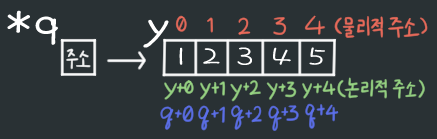
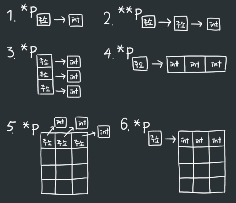
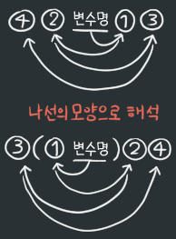
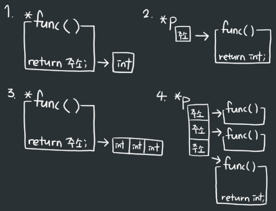

22/01/06
# 1. 포인터 연산자
## &(주소 연산자)
- 단항연산자
- 변수의 주소값을 리턴
- ex)<br>

  ```c
  int x = 3;
  printf("%d, ", &x); // 변수의 주소 출력
  printf("%d", x); // 변수의 값 출력
  ```
  
- 결과 : 주소값, 3<br>

**※ 배열의 이름은 주소값을 나타낸다!**<br>

```c
int arr[5] = {1,2,3,4,5};

printf("%d", arr);
```

결과 : 주소값<br>

&단순변수 = 변수명

## *(참조 연산자)
- 포인터
- 주소를 가리키고 있다.
- 사용법
  
  ```c
  // 단순변수
  int x = 1;
  int *p; // 포인터 선언
  p = &x; // x의 주소를 가리킴
  ```

    <br>

  ```c
  // 배열
  int y[5] = {1,2,3,4,5};
  int *q = y; // 배열명 자체가 주소이기 때문에 '&'연산자 없이 사용 가능
  ```

    <br>

# 2. 포인터와 배열
- 포인터가 배열을 가리킬 시 `배열 전체`를 가리킴
- 배열 내부의 값(index) 가리키기<br>
{: width="400"}<br>
- q\[0\] = q+0 = y+0 = y\[0\] = 1
- q\[3\] = q+3 = y+3 = y\[3\] = 4<br>

## 포인터 index, 배열 index

```c
int y[10];
printf("%d", y[11]); // error!

int *p = y;
printf("%d", p[11]); // ok
```
- 배열의 index
  - 초기화시 배열의 크기가 정해짐
  - 크기는 변하지 않음
  - 배열 크기보다 큰 index 지정시 오류발생

- 포인터의 index
  - 포인터는 `메모리 전체`를 <u>배열</u>로 봄
  - 포인터가 가리키는 배열의 index를 초과하면 그 다음 주소를 가리킨다.

## 포인터의 배열 설정

```c
int a[10];
int *q;

q = &a[3]; // q의 index 설정
```
<br>

배열|a\[0\]|a\[1\]|a\[2\]|a\[3\]|a\[4]|a\[5]|a\[6]|a\[7]|a\[8]|a\[9]
:---:|:---:|:---:|:---:|:---:|:---:|:---:|:---:|:---:|:---:|:---:
포인터|q-3|q-2|q-1|**q**|q+1|q+2|q+3|q+4|q+5|q+6

- 포인터 index 설정에 따라 배열의 index와는 다를 수 있다.

# 3. 형의 합성
- 기본
  1. int *p;
  2. int **p;
  3. int *p\[3];
  4. int (*p)\[3];
  5. int *p\[3]\[4];
  6. int (*p)\[3]\[4];

{: width="400"}<br>

- 우선 증가 나선 법칙
  - '변수명 \>\> 오른쪽 \>\> 왼쪽 \>\> 오른쪽' 순으로 해석하는 법칙
  - 만약 괄호()가 있다면 괄호를 먼저 본다.<br>
  <br>

  1. int *func(void);
  2. int (*p)(void);
  3. int (*func(void))\[3];
  4. int (*p\[3])(void);

{: width="400"}<br>

# 4. 함수의 배열 값 리턴
- 단순변수인 경우 함수에서 리턴할 때 값이 그대로 리턴됨
- 배열인 경우 함수에서 리턴할 때 값이 들어오지 않음
  - 함수가 끝나면 함수안의 모든 자료들이 사라지기 때문
  - 배열명은 `값`이 아닌 `주소`

- malloc(크기) : 메모리 공간을 확보하는 함수
  - 함수의 자료를 메모리에 저장해 리턴될 수 있게 해준다.

- 사용법
  - *변수 = (데이터타입 *)malloc(크기);

- 예시<br>

```c
#include <stdio.h>
#include <stdlib.h> // for malloc()

char *func();

int main() {
    char *p;
    p = func();
}

char *func() {
    char *x;
    x = (char *)malloc(5); // 메모리 5개 할당

    return x;
}
```

# 5. 같은 리턴, 요소 함수 포인터로 가리키기

```c
float add(float, float);
float mul(float, float);
float sub(float, float);
float mol(float, float);

int main() {
    float (*p)(float, float); // float func(float, float) 함수 가리킴

    p = add; // add함수를 가리킴
}
```