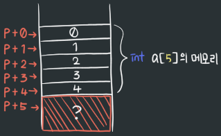
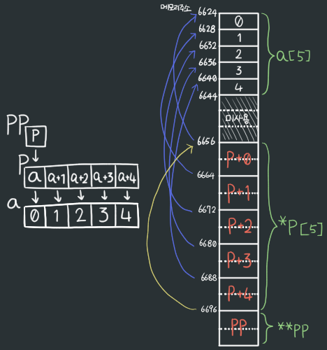
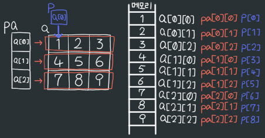
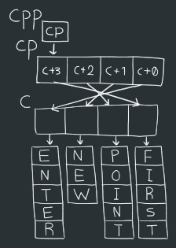
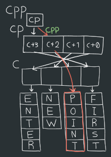
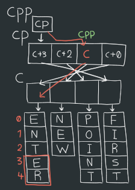
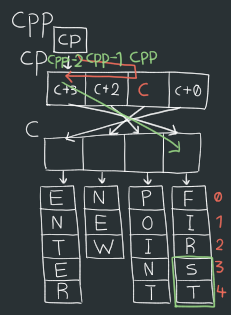
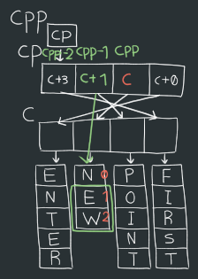
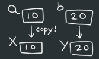
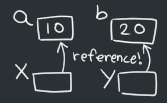

22/01/07
# 1. 포인터 연산

## 1. 단순 연산

```c
int a[] = {0, 1, 2, 3, 4}; // 선언&초기화 = 데이터 크기 자동으로 지정됨.

int i, *p;

// 1.
for(p=&a[0], i=1; i<=5; i++)
    printf("%d\n", p[i]);

// 2.
for(p=a, i=0; p+i<=a+4; p++,i++)
    printf("%d\n", *(p+i));

// 3.
for(p=a+4, i=0; i<=4; i++)
    printf("%d\n",p\[-i]);
```
1. p = &a\[0] → p+0의 값 = a\[0]의 주소 → p = 0
- 
   value|0|1|2|3|4
   :---:|:---:|:---:|:---:|:---:|:---:
   a_indx|0|1|2|3|4
   p_indx|p+0(≡p\[0])|p+1(≡p\[1])|p+2(≡p\[2])|p+3(≡p\[3])|p+4(≡p\[4])

- i 값|1|2|3|4|5
  :---:|:---:|:---:|:---:|:---:|:---:
  p\[i]|1|2|3|4|??

- 결과
  - 1
  - 2
  - 3
  - 4
  - ??<br> 
  **※포인터는 메모리 전체를 배열로 보기 때문에 선언된 배열의 값이 없더라도 다음 메모리에 있는 무언가를 불러올 수 있음**<br>

<br>

2. p = a → a = a\[0] → p+0의 값 = a\[0]의 주소 → p = 0
- 
  value|0|1|2|3|4
  :---:|:---:|:---:|:---:|:---:|:---:
  a_indx|0|1|2|3|4
  p_indx|p+0|p+1|p+2|p+3|p+4

- p + i < a + 4 → p\[i] < a\[4] (a\[4] = 4) : **p\[i]가 a\[4] 즉, 4보다 작거나 같다면 for문 실행**

- \*(p+i)|0|2|4|6|8
  :---:|:---:|:---:|:---:|:---:|:---:
  p++|0|1|2|3|4
  i++|0|1|2|3|4

- \*(p+i) <= 4인 경우 : \*(p+0), \*(p+2), \*(p+4) &nbsp; &nbsp; ※ \*(p+1) = p\[1]
- 결과
  - 0
  - 2
  - 4

3. p = a + 4
- 
  value|0|1|2|3|4
  :---:|:---:|:---:|:---:|:---:|:---:
  a_indx|0|1|2|3|4
  p_indx|p-4|p-3|p-2|p-1|p+0

- 
  i|0|1|2|3|4
  :---:|:---:|:---:|:---:|:---:|:---:
  p\[-i]|p\[0]|p\[-1]|p\[-2]|p\[-3]|p\[-4]
  value|4|3|2|1|0

- 결과
  - 4
  - 3
  - 2
  - 1
  - 0

## 2. 타입 연산
- 포인터는 같은 타입만 참조할 수 있다.
- 불가능

  ```c
  int x = 1;
  float y = 1.1;
  float *p = y; // 가능
  p = x; // error!
  ```

  - int 메모리 : 4bit
  - float 메모리 : 8bit
  - 포인터는 메모리의 주소를 참조.(int를 가리키면 4byte 참조, float를 가리키면 8byte 참조)
  - 메모리 크기 차이 때문에 다른 타입을 연결할 수 없음

```c
int a[] = {0,1,2,3,4};
int *p[] = {a, a+1, a+2, a+3, a+4};
int **pp = p;

// 1.
pp++;
printf("%d %d %d\n", pp-p, *pp-a, **pp);

// 2.
*pp++;
printf("%d %d %d\n", pp-p, *pp-a, **pp);

// 3.
*++pp;
printf("%d %d %d\n", pp-p, *pp-a, **pp);
```

- 변수의 관계<br>
  {: width="400"}
<br>
  - 실행결과 포인터 연산자는 8byte의 크기를 가지고 있었음

1. pp++ \>> p + 1
- pp-p = (p + 1) - p = (메모리주소)6664 - 6656 = 8(8x1) \>> 1(포인터의 차를 출력)
- *pp-a = \*(p + 1) - a = 1 - 0 = 1(둘 다 값을 가리킴으로 값의 계산)
- *\*pp = 1(주소를 두 번 따라가면 값이 나옴)

2. *pp++ \>> \*(pp++) \>> \*(p + 2) \>> 2
- pp-p = (p + 2) - p = 6672 - 6656 = 16(8x2) \>> 2
- *pp-a = \*(p + 2) - a = 2 - 0 = 2
- *\*pp = 2

3. *++pp \>> \*(++pp) \>> \*(p + 3) \>> 3
- pp-p = (p + 3) - p = 6680 - 6656 = 24(8x3) \> 3
- *pp-a = *(p + 3) - a = 3 - 0 \>> 3
- *\*pp = 3

# 2. 다차원 배열
## 1. 모양
```c
int a[3][3] {
    {1,2,3},
    {4,5,6},
    {7,8,9}
};

int *pa[3] = {a[0],a[1],a[2]};

int *p = a[0];
```
- 변수의 관계<br      >
  {:width="400"}<br>

- 주소 출력
  - pa : pa 자체 주소
  - 같은 주소
    - pa\[0]
    - pa\[0]+0
    - a\[0]+0
    - p+0
    - p
- 값 출력(모두 같은 값)
  - pa\[0]\[0]
  - *(pa\[0]+0)
  - a\[0]\[0]
  - *(a\[0]+0)
  - *(p+1)
  - *p

## 2.

```c
char *c[] = {"ENTER", "NEW", "POINT", "FIRST"};
char **cp[] = {c+3, c+2, c+1, c+0};
char ***cpp = cp;

main(){
  printf("%s", **++cpp); // 1.
  printf("%s ", *--*++cpp + 3); // 2.
  printf("%s", *cpp[-2] + 3); //3.
  printf("%s\n", cpp[-1][-1] + 1); // 4.
}
```

- 변수 관계<br>
<br>

1. \**(++cpp) \>> \*(cp\[1]) \>> c+2 \>> POINT<br>

2. \*\--*(++cpp)+3 \>> \*\--\*(cp\[2])+3 \>> \*(--(c+1))+3 \>> *(c+0)+3 \>> ENTER + 3 \>> ER (+3 : 배열의 4번째 자리부터 사용)<br>

3. \*cpp\[-2] + 3 \>> \*(c+3)+3 \>> FIRST + 3 \>> ST<br>

4. cpp\[-1]\[-1] + 1 \>> (cpp\[-1])\[-1]+1 \>> (c+2)[-1]+1 \>> (c+1)+1 \>> NEW + 1 \>> EW<br>
<br>

결과 : POINTER STEW

# 3. 함수 호출 방법
## 1. call by value
- 값을 복사해서 사용
- 

```c
void swap(int, int);
int main() {
  int a = 10;
  int b = 20;

  swap(a, b);

  printf("in main : a = %d, b = %d\n", a, b);
}
void swap(int x, int y) { // 값 복사해서 불러오기
  int temp;

  temp = x; // temp : 10
  x = y; // x : 20
  y = temp; // y : 10

  printf("in func : x = %d, y = %d\n", x, y);
}
```

- 결과
  - in func : x = 20, y = 10
  - in main : a = 10, b = 20

- 함수 내부에서는 x, y 값이 바뀌었지만, main으로 넘겨주지 못함
  - 함수는 사용이 끝나면 모든 정보가 소멸됨!
  - x, y또한 사라지기 때문에 main의 a, b의 값은 변함 없음

## 2. call by reference
- 값을 참조해서 사용
- 

```c
void swap(int*, int*);
int main() {
  int a = 10;
  int b = 20;

  swap(&a, &b);

  printf("in main : a = %d, b = %d\n", a, b);
}
void swap(int *x, int *y) { // 값의 주소 참조
  int temp;

  temp = *x; // temp : 10
  *x = *y; // *x : 20
  *y = temp; // *y : 10

  printf("in func : *x = %d, *y = %d\n", *x, *y);
}
```

- 결과
  - in func : x = 20, y = 10
  - in main : a = 20, b = 10

- 함수에서 주소를 이용해 값을 변경하는 것으로, 원본을 직접 바꿀 수 있음