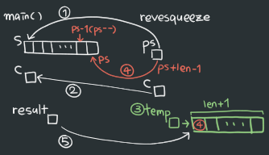

22/01/07
# 주어진 문자열에 다른 주어진 문자를 제거하고 역순화 시킨 문자열 만드는 함수
- ex)abcabc b (입력) → caca (출력)

- 조건
  - 함수명 : revsqueeze
  - 포인터만 사용할 것(배열x)

```c
#include <stdio.h>
#include <string.h> // for strlen()
#include <stdlib.h> // for malloc()

// 함수 선언

int main() {

    // 변수 선언

    while ((s[i++] = getchar()) != '\n');

    s[i--] = '\0';

    c = getchar();

    result = revsqueeze(s, c);

    printf("%s\n", result);

    return 0;
}

// 함수 정의
{
    // 변수 선언

    len = strlen(ps);

    temp = (char *)malloc(len + 1); // 결과 문자열 저장 공간 생성

    // 알고리즘

    return temp;
}
```
<br>
<br>

## 소스 코드

```c
#include <stdio.h>
#include <string.h>
#include <stdlib.h>

char *revsqueeze(char*, char); // 1. 함수 선언

int main() {

    int i=0;
    char s[80], c, *result;

    while ((s[i++] = getchar()) != '\n');

    s[i--] = '\0';

    c = getchar();

    result = revsqueeze(s, c); // 2. 포인터 변수 = 포인터 함수

    printf("%s\n", result);

    return 0;
}

char *revsqueeze(char *ps, char c) 
{
    int i, j=0, len;
    char *temp;

    len = strlen(ps); // 포인터의 길이만큼 len 설정

    temp = (char *)malloc(len + 1); // 포인터 길이만큼 메모리 확보

    ps = ps + len -1; // 3. 포인터의 위치를 포인터의 끝으로 변경(문제 조건을 위한 설정)

    for(i=0; i<len; i++) { // len(포인터의 길이)만큼 for문 실행
        if (*ps != c) // 4. 포인터가 가리키는 값이 c와 같지 않으면
            *(temp + j++) = *ps--; // temp에 c 추가 후 포인터 위치 변화
        else
            ps--; // 포인터와 c가 같으면 건너뛰기
    }
    *(temp - j) = '\0';

    return temp;
}
```

1. main()의 배열(s)을 call by reference로 사용하기 위해 `*` 사용

2. 포인터 함수 결과를 저장하기 위해 포인터 변수 사용

3. ps = ps\[0] \>> ps\[0]을 ps 마지막으로 위치이동 = ps + len \>> ps\[len] \>> ps의 마지막 위치 = len -1 \>> ps + (len - 1)
- ex)
  - s = "hello"
  - s\[0] = h, s\[1] = e, s\[2] = l, s\[3] = l, s\[4] = o
  - strlen(s) = 5
  - s\[strlen(s)] = s\[5] = '\0'(NULL)
  - s\[strlen(s) - 1] = s\[4] = 'o'

4. \*ps != c
- \*ps = \*ps가 참조하는 값
- ex)
  - s[] = {1,2};
  - \*ps = s;
  - \*ps ≡ *(ps + 0) ≡ \*ps\[0] ≡ 1

- != 아니다!
  ```c
  int n = 3;
  if (n != 2) printf("3이 아니다!");
  else printf("3이다!");
  ```
  <br>
  결과 : 3이다!<br>

- if ( \*ps != c ) : ps가 참조하는 값이 c가 아니라면

<br>

## 실행 순서



- abcab a (입력)
- s = {'a', 'c', 'c', 'a', 'b'}
- c = 'a'
- revesqueeze(s, c)
- len = strlen(s) = 5
- temp = (char *)malloc(len + 1) \>> temp에 6바이트 메모리 확보
- ps = ps\[4]
- for j = 0, 1, 2, 3, 4
- j값|i값|\*ps값|\*ps != c 결과|*(temp+i)값
  :---:|:---:|:---:|:---:|:---:
  0|0|b|T(b!=a)||
  ||0|||b
  ||1|a|||
  1|1|a|F(a!=a)||
  |||c||
  2|1|c|T(c!=a)||
  ||1|||c
  ||2|c|||
  3|2|c|T(c!=a)||
  ||2|||c
  ||3|a|||
  4|3|a|F(a!=a)||
  |||NULL|||
  5|||||

- *(temp + 3) = '\0'
- *temp → {'b', 'c', 'c'}
- return temp
- main() &nbsp; result = {'b', 'c', 'c'}
- printf("%s\n", result);

## 결과
- bcc