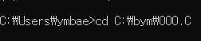

22/01/10
# 1. main(int argc, char *argv[])
- main에 사용될 수 있는 파라미터
- cmd창에서 사용됨
- argc : 함수 main에 전달되는 데이터의 개수
- argv : 함수에 전달되는 실질적 데이터
- 데이터는 공백기준으로 나뉜다

ex<br>

```c
#include <stdio.h>

int main(int argc, char *argv[]) {
    int i;

    for (i=0; i<argc; i++)
        printf("argv[%d]의 데이터는 %s입니다.\n", i, argv[i]);
    printf("argc의 개수는 %d개 입니다.\n", argc);

    return 0;
}
```

cmd 실행<br>
- cd 실행파일이 있는 경로<br>

  

- ex hello my name is ym<br>

  

- ex : 실행파일
- hello my name is ym : 공백을 기준으로 데이터 나눠짐
- argv\[0] : 실행파일

# 2. structure(구조체)
- 사용자가 정의한 자료형의 집합체 → 구조체
## - 구조체 정의
  ```c
  struct Personal {
      char name[80];
      int age;
  };
  ```

- struct 구조체_이름 { 자료형 이름; };
- 엑셀의 hearder같은 모양<br>

excel|A|B||
:---:|:---:|:---:|:---:
**1**|**name**|**age**|<< struct|
2|홍길동|20||
3|김철수|15||

- 메모리상에 구조체의 자료형들은 아직 자리가 잡혀있지 않음(메모리 할당 x)

## - 구조체 변수 선언
```c
struct Personal ps; // ps = struct Personal
```

## - 구조체 정의와 동시에 변수 선언
```c
 struct Personal { // 구조체 정의
      char name[80];
      int age;
  } ps; // 구조체 변수 이름
```

## - 구조체 변수의 자료형 접근
- 변수.자료형이름

```c
ps.name; // struct Personal의 char name[80]에 접근
```

## - 구조체 자료형 초기화
```c
struct Personal psl = {"홍길동", 20}; // struct Personal변수 psl에 값 초기화
// or
ps = {"홍길동", 20}; // 자료 순서대로 초기화됨
// or
ps = {.name = "김영희", .age = 15};
```

## - 구조체 변수 자료형 초기화
```c
// char[]
strcpy("김철수", ps.name); // strcpy(붙여넣을 배열, 복사할 배열);
// int
ps.age = 15;
```

## - 구조체 포인터
```c
struct Personal *ptr; // 변수명 : ptr, 자료형 크기 : struct Personal
ptr = &ps; // ps 주소를 참조

ptr -> age = 30; // ps의 age 값에 30을 입력
printf("%d\n", ptr ->age);
```

결과 : 30