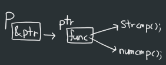
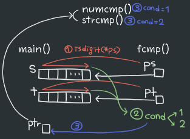

22/01/10
# 하나의 포인터 변수로 두 함수(strcmp, numcmp)를 다루는 함수(fcmp) 만들기
- strcmp() : 문자열 비교하여 `1, 0, -1`로 리턴
  - strcmp(abc, abb) → 1
  - strcmp(123.2, 123.1) → 1
- numcmp() : 숫자를 비교하여 `1, 0, -1`로 리턴
  - trcmp(123.2, 123.1) → -1
- 두 개의 문자열을 입력받아 두 문자열이 숫자열이면 numcmp()로, 문자가 하나라도 있으면 strcmp()로 함수 연결해 결과 출력

```c
#include <stdio.h>
#include <ctype.h> // 한 문자에 대한 라이브러리
#include <string.h> // for strcmp()
#include <stdlib.h> // for atof() → 문자열을 실수로 변경

#define NUM 1
#define CHARCT 2

int numcmp(const char *, const char *); // numcmp 선언

// void fcmp 선언

int main() {
    char s[80], t[80];

    // ptr은 두 개의 const char*를 인자로 가지고 있는 함수의 주소를 참조하는 변수
    int (*ptr)(const char*, const char*);

    scanf("%s %s", s, t);
    fcmp(&ptr, s, t); // fcmp 콜
    printf("%d\n", ptr(s,t));

    return 0;
}

// numcmp() 정의
int numcmp(const char *ps, const char *pt) {
    float a, b;

    a = atof(ps);
    b = atof(pt);

    if(a>b)
        return 1;
    else if(a<b)
        return -1;
    else
        return 0;
}

// fcmp() 정의
void fcmp() {
    int cond;

    cond = NUM;

    if(*ps == '-')
        ps++;
    
    while (cond == NUM && *ps != NULL)
        if(isdigit(*ps) || *ps == '.')
            ps++;
        else
            cond = CHARCT;

    if(*pt == '-')
        pt++;
    
    while (cond == NUM && *pt != NULL)
        if(isdigit(*pt) || *pt == '.')
            pt++;
        else
            cond = CHARCT;

    // ps, pt 모두 숫자열이면 numcmp 함수 연결
    // 아니면 strcmp 함수 연결
}
```
<br>
<br>

## 소스코드

```c
#include <stdio.h>
#include <ctype.h> // 한 문자에 대한 라이브러리
#include <string.h> // for strcmp()
#include <stdlib.h> // for atof() → 문자열을 실수로 변경

#define NUM 1
#define CHARCT 2

int numcmp(const char *, const char *); // numcmp 선언

void fcmp(int(**)(const char *, const char *), char *, char *); // 1. fcmp 선언

int main() {
    char s[80], t[80];

    int (*ptr)(const char*, const char*);

    scanf("%s %s", s, t);
    fcmp(&ptr, s, t); // fcmp 콜
    printf("%d\n", ptr(s,t));

    return 0;
}

// numcmp() 정의
int numcmp(const char *ps, const char *pt) {
    float a, b;

    a = atof(ps);
    b = atof(pt);

    if(a>b)
        return 1;
    else if(a<b)
        return -1;
    else
        return 0;
}

// fcmp() 정의
void fcmp(int (**p)(const char*, const char*), int *ps, int *pt) {
    int cond;

    cond = NUM; // NUM = 1, #define에 의한 설정

    if(*ps == '-') // 음수일 경우 ps 위치 변경 + 1
        ps++;
    
    while (cond == NUM && *ps != NULL) //cond가 1이고 *ps가 NULL이 아닐동안 roop
        if(isdigit(*ps) || *ps == '.') // 2. isdigit(int) = 숫자를 판단하는 함수
            ps++;
        else
            cond = CHARCT; // CHARCT = 2

    if(*pt == '-')
        pt++;
    
    while (cond == NUM && *pt != NULL)
        if(isdigit(*pt) || *pt == '.')
            pt++;
        else
            cond = CHARCT;

    // 3. ps, pt의 결과에 따른 함수 연결
    if(cond == NUM) // numcmp 함수 연결
        *p = numcmp;
    else // strcmp 함수 연결
        *p = strcmp;
}
```

- fcmp(&ptr, s, t) :
  - 문자열 s, t를 입력받아 s, t의 배열이 숫자인 경우 numcmp(), 아닌 경우 strcmp()로 전달해줄 포인터변수 ptr
  - 포인터변수를 매개로 사용했기에 이중포인터(\*\*)로 포인터변수가 참조하는 주소를 참조
  - 

- isdigit(int) : int가 숫자일 경우 1(T), 아닐 경우 0(F)을 return
  - isdigit(int)가 T이거나 *ps가 '.'일 경우 ps += 1
  - 아닐 경우 = 숫자가 아닌 경우, cond = 2
  - cond3 = 2가 되면 while이 돌아가지 않고 빠져나옴

- ps, pt의 결과가 NUM(1)일 경우 포인터함수는 numcmp를 가리키고
- ps, pt의 결과가 CHARCT(2)일 경우 포인터함수는 strcmp를 가리킴

- int (\*ptr)(const char\*, const char\*) : [같은 리턴, 요소 함수 포인터로 가리키기](https://bymin0.github.io/posts/C%EC%96%B8%EC%96%B4-%EA%B3%B5%EB%B6%80-%EC%A0%95%EB%A6%AC(6-3)/#5-%EA%B0%99%EC%9D%80-%EB%A6%AC%ED%84%B4-%EC%9A%94%EC%86%8C-%ED%95%A8%EC%88%98-%ED%8F%AC%EC%9D%B8%ED%84%B0%EB%A1%9C-%EA%B0%80%EB%A6%AC%ED%82%A4%EA%B8%B0)

## 실행순서
- scanf("%s %s", s, t) : s, t 문자열 받기
- fcmp(&ptr, s, t)
- *ps, *pt의 첫 문자가 `-(음수)`면 ps, pt ++
- while : 숫자일 경우 실행, 문자가 있으거나 ps, pt가 NULL이면 빠져나옴
- 숫자열이면 *p의 주소는 numcmp()
- 문자열이면 *p의 주소는 strcmp()
- 