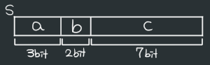

22/01/11
# 1. typedef
- 모든 자료형의 별칭을 지정해 줄 수 있음
- 주로 struct에 많이 사용

```c
typedef int INT;
typedef char C;

int main() {
    INT i; // ≡ int i;
    C c; // ≡ char c;
}
```

- struct 별칭 지정하기

```c
typedef struct People {
    int age;
    char name[80];
    char addr[80];
} P;
```

- struct 별칭 사용하기

```c
P p1; // struct People의 별칭 P의 변수 p1 생성
```

## typedef의 기준은 '이름'

```c
typedef char str[80]; // str : char[80]의 별칭
str x; // → char x[80];

typedef int *k; // k : int*의 별칭
k x; // → int *x;
```

# 2. 구조체의 비트 필드
1. struct 멤버를 비트단위로 저장 가능

```c
struct sct {
    unsigned int a : 3; // 정수형 자료형 : 비트 할당수
    unsigned int b : 2;
    unsigned int c : 7;
}s;

ss.a = 7; // 111(3비트)
ss.b = 1; // 1(1비트)
ss.c = 63; // 111111(6비트)

printf("s.a = %d, s.b = %d, s.c = %d\n", s.a, s.b, s.c);
```

- 
- 결과: s.a = 7, s.b = 1, s.c = 63
<br>

2. 비트필드 설정 값 이상의 크기 사용 시 결과값 다르게 나옴

```c
struct sct {
    unsigned int a : 3;
    unsigned int b : 2;
    unsigned int c : 7;
}s;

s.a = 15; // 1111(4비트)
s.b = 5; // 101(3비트)
s.c = 255; // 1111 1111(8비트)

printf("s.a = %d, s.b = %d, s.c = %d\n", s.a, s.b, s.c);
```

  - 컴파일러 : \[Warning] large integer implicitly truncated to unsigned type (정수 오버플로우)
  - 결과 : s.a = 7, s.b = 1, s.c = 127
