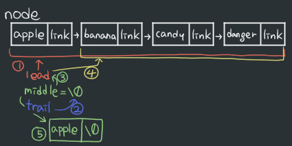

22/01/11
# 단어리스트 입력받아 거꾸로 리스트 출력하기
- 단어리스트 struct node 생성
  - ```c
    struct node {
        char *name;
        struct node *link; // struct node를 참조하는 포인터변수 link
    };
    ```

- 단어 입력받기(함수 getname())
  - getchar()로 입력받기
- getname()을 node에 추가(함수 addlist(), namecopy())
  - (node *)가 비어있으면 메모리 할당, node.name에 namecopy()로 단어 추가
  - node.link에 다음 단어 연결(재귀함수)
- **★역순환 리스트 생성(invert())★**
- 역순환 리스트 출력(listprint())

```c
#include <stdio.h>
#include <string.h>
#include <stdlib.h>

struct node {
    char *name;
    struct node *link;
};

int getname(char *);
struct node *addlist(struct node *, char *); // addlist함수는 struct node 참조
char *namecopy(char *);

// invert함수 선언
// malloc 사용 x, 주어진 연결 리스트에서 직접 link 변경시킬 것

void listprint(struct node *);

int main() {
    struct node *root;
    char name[80];
    root = NULL; // NULL pointer

    while(getname(name) != EOF) // EOF : End Of File, `ctrl-z`누르면 실행
        root = addlist(root, name);
    
    listprint(root);

    root = invert(root);
    printf("----- invert -----\n");
    listprint(root);

    return 0;
}

int getname(char *pname) {
    int i = 0;
    char c;

    while(((c=getchar()) != '\n') && c != EOF)
        *(pname + i++) = c;
    
    if (c == '\n')
        *(pname + i) = '\0';
    if (c == EOF)
        *pname = EOF;
    return *pname;
}

struct node *addlist(struct node *p, char *w) {
    if (p == NULL) { // null값인지 확인 후
        p = (struct node *)malloc(sizeof(struct)); // 메모리 할당 >> 융통성은 있지만 속도는 떨어짐
        p -> name = namecopy(w);
        p -> link = null;
    } else
        p -> link = addlist(p->link, w);
    
    return p;
}

char *namecopy(char *s) {
    char *p;
    int i = 0;

    p = (char *)malloc(strlen(s) + 1);
    while((*(p+1) = *(s+i)) != '\0')
        i++;

    return p;
}

void listprint(struct node *p) {
    while(p != NULL) {
        printf("%s\n", p -> name);
        p = p -> link;
    }
}

// invert 정의
```
<br>
<br>

## 소스코드
```c
#include <stdio.h>
#include <string.h>
#include <stdlib.h>

struct node {
    char *name;
    struct node *link;
};

int getname(char *);
struct node *addlist(struct node *, char *);
char *namecopy(char *);

// invert함수 선언
struct node *invert(struct node *);

void listprint(struct node *);

int main() {
    struct node *root;
    char name[80];
    root = NULL; // NULL pointer

    while(getname(name) != EOF) // EOF : End Of File, `ctrl-z`누르면 실행
        root = addlist(root, name);
    
    listprint(root);

    root = invert(root);
    printf("----- invert -----\n");
    listprint(root);

    return 0;
}

int getname(char *pname) {
    int i = 0;
    char c;

    while(((c=getchar()) != '\n') && c != EOF)
        *(pname + i++) = c;
    
    if (c == '\n')
        *(pname + i) = '\0';
    if (c == EOF)
        *pname = EOF;
    return *pname;
}

struct node *addlist(struct node *p, char *w) {
    if (p == NULL) {
        p = (struct node *)malloc(sizeof(struct));
        p -> name = namecopy(w);
        p -> link = null;
    } else
        p -> link = addlist(p->link, w);
    
    return p;
}

char *namecopy(char *s) {
    char *p;
    int i = 0;

    p = (char *)malloc(strlen(s) + 1);
    while((*(p+1) = *(s+i)) != '\0')
        i++;

    return p;
}

void listprint(struct node *p) {
    while(p != NULL) {
        printf("%s\n", p -> name);
        p = p -> link;
    }
}

// invert 정의
struct node *invert(struct node *lead) {
    struct node *trail, *middle;
    middle = NULL;
    while(lead) { // lead가 NULL이 아닐 동안
        trail = middle;
        middle = lead;
        lead = lead -> link;
        middle -> link = trail;
    }
    return middle;
}
```

## 실행 순서
- apple<br>
  banana<br>
  candy<br>
  danger<br>
  EOF (입력)

- getname(name)
  - char c = apple
  - \*p = c
- root = addlist(root, name)
  - p값|\*p->name|\*p->link|\*w
    :---:|:---:|:---:|:---:
    NULL|NULL|NULL|apple
    메모리할당|namecopy(w)|NULL||
    ||apple|NULL||

- 


- getname(name)
  - char c = banana
  - \*p = c
- root = addlist(root, name)
  - p값|\*p->name|\*p->link|\*w
    :---:|:---:|:---:|:---:
    not null|apple|NULL|banana
    |||addlist(p->link,w)||
    NULL|NULL|NULL|banana
    메모리할당|namecopy(w)|NULL||
    ||banana|NULL||

- 


- getname(name)
  - char c = candy
  - \*p = c
- root = addlist(root, name)
  - p값|\*p->name|\*p->link|\*w
    :---:|:---:|:---:|:---:
    not null|banana|NULL|candy
    |||addlist(p->link,w)||
    NULL|NULL|NULL|candy
    메모리할당|namecopy(w)|NULL||
    ||candy|NULL||

- 


- getname(name)
  - char c = danger
  - \*p = c
- root = addlist(root, name)
  - p값|\*p->name|\*p->link|\*w
    :---:|:---:|:---:|:---:
    not null|candy|NULL|danger
    |||addlist(p->link,w)||
    NULL|NULL|NULL|danger
    메모리할당|namecopy(w)|NULL||
    ||danger|NULL||

- 

- listprint(root);
- apple<br>
  banana<br>
  candy<br>
  danger<br>

- \-\-\-\-\- invert \-\-\-\-\-
- invert(root)
  - 
  <br>

  - invert 실행순서
  - 
  - No|lead|middle|trail
    :---:|:---:|:---:|:---:
    1,2|apple\|banana...|NULL|NULL
    3||apple\|banana...||
    4,5|banana...|apple\|NULL||

  

  - 
  - No|lead|middle|trail
    :---:|:---:|:---:|:---:
    1,2|banana...||apple\|NULL
    3||banana...||
    4,5|candy...|banana\|apple...||

  - 
  - No|lead|middle|trail
    :---:|:---:|:---:|:---:
    1,2|candy...||banana\|apple...
    3||candy...||
    4,5|danger...|candy\|banana...||

  - 
  - No|lead|middle|trail
    :---:|:---:|:---:|:---:
    1,2|danger\|NULL||candy\|banana...
    3||danger\|NULL||
    4,5|\0|danger\|candy...||

- listprint(root)
- danger<br>
  candy<br>
  banana<br>
  apple<br>


## 결과

apple<br>
banana<br>
candy<br>
danger<br>
\-\-\-\-\- invert \-\-\-\-\-<br>
danger<br>
candy<br>
banana<br>
apple<br>
