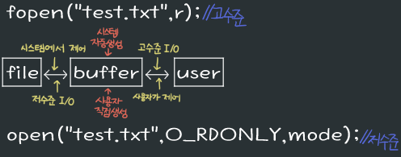

22/01/11
# 1. Formatted I/O
## 1. scanf()
- 입력함수
- 사용법
  - scanf("포맷형식", 변수의 주소);
  - 정수 : scanf("%d", &num);
  - 문자 : scanf("%s", &char);
  - 배열 : scanf("%s", arr); / scanf("%d", arr);&nbsp; // 배열의 이름 : 주소
- 두 개 이상을 입력 받을 때
  - scanf("%s %s", str, &ch); \>> `%s %s` 사이에 콤마 찍지 않아도 괜찮음

## 2. printf()
- 출력함수
- 사용법
  - printf("포맷형식", 변수명);
  - 정수 : printf("%d", num);
  - 문자 : printf("%s", char);
  - 배열 : printf("%s", arr); / printf("%d", arr);
- 두 개 이상을 입력 받을 때
  - printf("%s, %s",str, ch);

# 2. Unformatted I/O
## 1. getc()
- 한 문자를 가져오는 함수
- 한 문자를 가져오고 내부적으로 다음 문자를 가리킨다.
- .png)
- getc(stdin) = getchar() // stdin = 키보드(표준 입력 파일)

## 2. getchar()
- #define getchar() getc(stdin)
- 사용자가 입력한 문자를 버퍼에 저장해놓았다가 엔터('\n')를 누르면 엔터 이전의 문자들 가져옴
  - abc 입력
  - buffer : abc 저장
  - \n
  - buffer : abc 출력
  - **buffer : \n 남아있음** \>> buffer 초기화 해줘야 함
- buffer 초기화<br>

```c
while (getchar() != '\n');
// '\n'를 만나기 전까지 버퍼에 저장 >> '\n'만나면 while문장을 빠져나오므로 \n가 버퍼에 입력되지 않음
```

## 3. putc()
- 한 문자를 쓰는 함수
- putc(문자, 문자를 입력할 파일);<br>
- putc(int c, stdout) = putchar() // stdout = 화면(표준 출력 파일)

## 4. putchar()
- #define putchar() putc(c, stdout)

# 3. 고수준, 저수준 I/O
- 사용자가 직접 파일을 건드리느냐, 간접적으로 파일을 건드리느냐에 따라 고수준과 저수준으로 나뉘어 진다.
- {: width="400"}

## 1. 고수준 파일 입출력
- 기본적으로 사용하는 파일 입출력
- 시스템에서 파일을 열 때 버퍼를 생성하고 그 버퍼에서 간접적으로 파일을 만짐
- 버퍼 단위로 읽고 쓰고
- 사용하기 쉬움

### - 주요 함수
- 파일 열기 : fopen("파일이름",모드);<br>
  - ```c
    FILE *fp;
    fp = fopen("test.txt", "r"); // test.txt의 읽기모드(r)로 열기
    ```

  - 모드 종류
    - 모드|의미|파일존재여부
      :---:|:---:|:---:
      r|텍스트 파일 읽기 전용|미 존재시 에러
      w|텍스트 파일 쓰기 전용|미 존재시 새로 생성 
      a|텍스트 파일 덧붙이기 전용|미 존재시 새로 생성
      r+|텍스트 파일 읽기+쓰기|미 존재시 에러
      w+|텍스트 파일 쓰기+읽기|미 존재시 새로 생성

- 데이터 쓰기 : fprintf(FILE* stream, "포맷", 변수); = printf()
  - ```c
    fprintf(fp, "%s", "hello"); // fp에 hello 입력
    ```

  - **fprintf(stdout, "포맷", 변수) = printf("포맷", 변수)**

- 데이터 읽어오기 : fscanf(FILE* stream, "포맷", 변수 주소); = scanf()
  - ```c
    fscanf(fp, "%s", str); // fp의 배열 읽어오기
    ```

  - **fscanf(stdin, "포맷", 변수) = scanf("포맷", 변수)**
  - 텍스트 파일의 공백을 기준으로 읽는다.
    - test.txt 내용 : abcdefg hijklmn opqrstu vwxyz
    - fscanf(fp, "%s", str);
    - 결과 : abcdefg
  - 읽은 데이터를 콘솔에 뿌리고 싶으면 printf() 사용[printf("%s", str);]

- 파일 닫기 : fclose(파일스트림);<br>
  - ```c
    fclose(fp);
    ```

  - 파일 사용 후 꼭 닫아줘야 한다.

## 2. 저수준 파일 입출력
- 파일 기술자의 번호에 의해 참조
  - 0 : 표준 입력, stdin(키보드)
  - 1 : 표준 출력, stdout(화면)
  - 2 : 표준 오류, stderr(화면)
- 0 ~ 2의 번호는 프로세스 실행 시 기본적으로 할당
- 3번부터 파일을 처음 열면 시작되는 파일 기술자
- 바이트 단위로 읽고 쓰기
- 속도 빠름(파일 직접 접근)

### - 주요 함수
- 파일 열기 : open("파일이름",사용모드[, mode_t mode])
  - ```c
    int fd;
    fd = open("test.txt",O_RDONLY); // test.txt를 읽기전용 모드로 열기
    ```

  - 사용 모드
    - 모드|의미
      :---:|:---:
      O_RDONLY|읽기 전용
      O_WRONLY|쓰기 전용
      O_RDWR|읽기 겸 쓰기
      O_APPEND|기존 파일에 덧쓰기

  - mode
    - 소유자, 그룹, 기타 사용자에게 읽기(r), 쓰기(w), 실행(x)의 권한을 8진수씩 나눠서 지정가능
    - 소유자|그룹|기타 사용자
      :---:|:---:|:---:
      r\|w\|x|r\|w\|x|r\|w\|x
      
    - 111111111(모든 권한 허용) : 0777(8진수로 표현)
    - 111000000(소유자만 권한 허용) : 0700

- 파일 닫기 : close(파일 디스크립터);
  - ```c
    close(fd);
    ```

# 4. Buffer
- 데이터를 임시적으로 저장하는 공간
- 버퍼가 가득 차게되면 출력

## - Buffering 종류
- full buffering : 일반 파일 \>> 버퍼가 가득 차면 출력
- line buffering : 키보드, 모니터 \>> '\n'기준 출력
  - ```c
    printf("abc"); // 버퍼에 저장만
    printf("def\n"); // abcdef 출력
    ```
    <br>

  - '\n'이 없어도 출력되는 `예외의 경우`
    - 출력을 대기하고 있는 상태에서 입력 요구
    - ```c
      printf("출력대기");
      scanf("%s",str); // 입력요구
      ```
    
    - fflush() 사용 : buffer 비우는 함수(buffer 출력!)
    - exit() 사용
    - 프로그램 종료
- no buffering - 표준 error파일 \>> 단순변수(데이터 하나밖에 저장 못함)이므로 바로바로 출력됨

# 5. FILE
- < stdio.h >에 존재
- 파일을 제어할 때 사용

```c
// dev C++
struct _iobuf {
    char *_ptr;
    int _cnt;
    char *_base;
    int _flag;
    int _file;
    int _charbuf;
    int _bufsiz;
    char *_tmpfname;
};
typedef struct _iobuf FILE;
```

# 5. 파일 새로 만들어 쓰고 읽기 예시
```c
#include <stdio.h>

int main() {
    char read1[10], read2[10];
    FILE *fp;

    // 파일 쓰기
    fp = fopen("test.txt","w"); // test.txt 없으면 새로 생성
    fprintf(fp, "%s", "Hello, World");
    fclose(fp); // 쓰기 종료

    // 파일 읽기
    fp = fopen("test.txt","r"); // test.txt 없으면 에러!
    fscanf(fp, "%s %s", read1, read2); // test.txt 스캔(공백을 기준으로 배열 나뉨)
    printf("%s %s", read1, read2); // 스캔한 변수 콘솔 출력
    fclose(fp); // 읽기 종료

    return 0;
}
```

결과 : Hello, World
