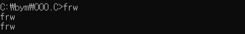
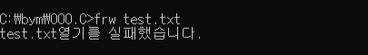
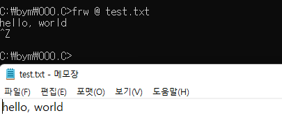
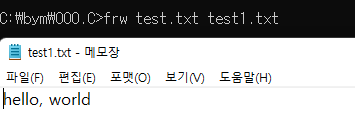

22/01/12
# main(int argc, char* argv[])을 이용해 파일 생성 후 글 쓰기, 복사, 읽기
- main(int argc, char* argv\[\])란 : [링크](https://bymin0.github.io/posts/C%EC%96%B8%EC%96%B4-%EA%B3%B5%EB%B6%80-%EC%A0%95%EB%A6%AC(8-1)/#1-mainint-argc-char-argv)<br>

실행할 문자|실행 결과
:---:|:---:
frw|frw출력
frw @ test.txt|test.txt 글쓰기
frw test.txt|test.txt 내용 읽기
frw test.txt test2.txt|test.txt의 내용을 test2.txt에 복사

- 파일명 : frw
- argv[]의 개수에 따라 위의 모든 기능을 제어(한 프로그램으로 만들기)

## 소스코드
```c
#include <stdio.h>
#include <stdlib.h>
#include <string.h>

int main(int argv, char* argv[]) {
    FILE *in, *out;
    char c;

    // argv[] 크기 1개 : argv[] 모니터에 출력
    if(argc == 1)
        while((c = getc(stdin)) != '\n')
            putc(c, stdout);
    
    // argv[] 크기 2개 : txt내용 읽기
    else if(argc == 2) {
        // 파일 읽기모드 시 파일 없으면 에러가 나므로 에러 처리
        if((out = fopen(argv[1], "r")) == NULL) {
            printf("%s열기를 실패했습니다.\n", argv[1]);
            exit(1);
        }
        while((c=getc(out)) != EOF) // out에 EOF를 만나기 전까지 문자 가져오기
            putc(c, stdout); // 모니터에 가져온 문자 출력
        fclose(out);
    }
    
    // argv[] 크기 3개
    else if(argc == 3) {
        // @ txt : txt 쓰기모드, 키보드로 받은 문자 txt에 입력
        if(!strcmp(argv[1], "@")) { // argv[1]과 @가 0(F)이라면>>strcmp 결과 0 : 같은 문자
            // txt를 쓰기모드로 여는데 오류가 있다면
            if((in = fopen(argv[2, "w"])) == NULL) {
                printf("%s열기를 실패했습니다.\n", argv[2]);
                exit(2);
            }
            while((c = getc(stdin)) != EOF) // 키보드에 `ctrl-z`가 눌리기 전까지
                putc(c, in); // txt에 문자 입력
            fclose(in);
        }
        // argv[1]의 txt 내용을 argv[2]의 txt에 복사
        else {
            // argv[1]파일이 없거나 오류가 있다면
            if((in = fopen(argv[1],"r")) == NULL) {
                printf("%s열기를 실패했습니다.\n", argv[1]);
                exit(3);
            }
            // argv[2]파일을 쓰기모드로 여는데 오류가 있다면
            if((out = fopen(argv[2], "w")) == NULL) {
                printf("%s열기를 실패했습니다.\n", argv[2]);
                exit(4);
            }
            while((c = getc(in)) != EOF) // argv[1]에 EOF를 만나기 전까지의 문자를
                putc(c, out); // argv[2]에 입력
            fclose(out);
            fclose(in);
        }
    }
    // 모든 경우의 수가 아닐 경우
    else {
        printf("잘못된 입력입니다\n");
        exit(5);
    }
    
    return 0;
}
```

## 결과
- frw
- 결과 : frw
- 
- frw test.txt
  - test.txt 없을 경우 : test.txt열기를 실패했습니다.
  - 
  - test.txt 있을 경우 : test.txt내용 모니터에 출력
  - 
- frw @ test.txt
- hello, world (입력)
- 결과 : test.txt 생성, 내용 입력(hello, world)
  - 
- frw test.txt test1.txt
- 결과 : test1.txt 생성, test.txt의 내용(hello, world)이 test1.txt에 입력
  - 
- frw test1.txt
- 결과 : test1.txt의 내용 출력
  - 