★★window 기준★★

# 1. cmd 사용
1. win + R
2. cmd
    
   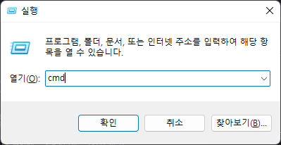

3. cd <가상환경 만들 폴더 경로>

4. python -m venv <가상환경이름>
    
   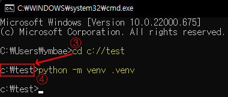

5. 가상환경이 만들어진 모습
    
   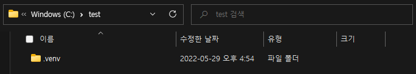

# 2. Visual Studio Code(vs code) 사용
1. vs code 하단 cmd 창 열기
    
   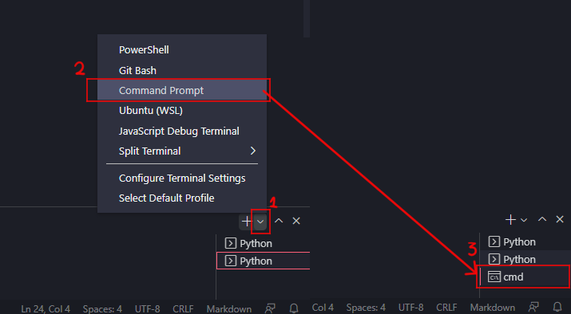

2. 위의 사진과 같은 모양이 없다면 메뉴 중 새로운 터미널 생성
    
   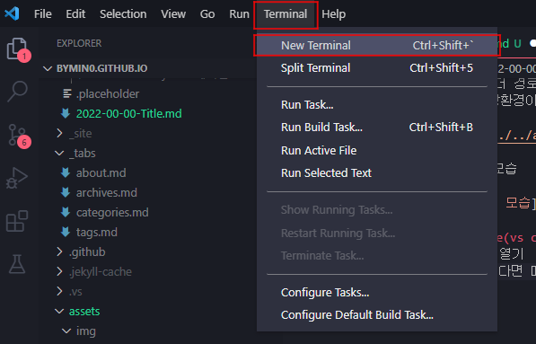

3. py -3 -m venv <가상환경이름>
    
   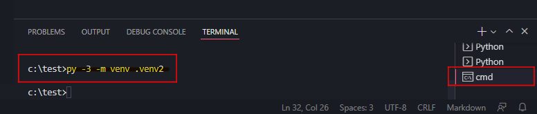

4. 가상환경이 만들어진 모습
   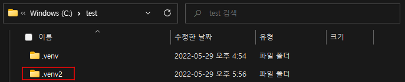

# 3. 가상환경 실행(vs code)
1. ctrl + shift + p
   
2. Python:Select Interpreter (클릭)
    
   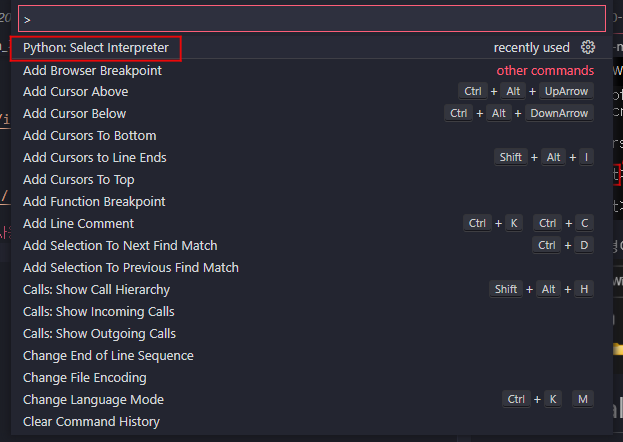

3. Enter interpreter path.. (클릭)
    
   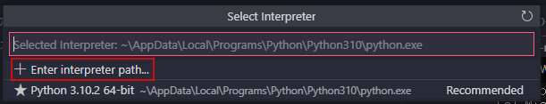

4. Find... (클릭)
    
   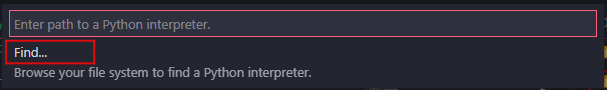

5. ..\\<가상환경이름>\\Scripts\\python.exe >> Select Interpreter
    
   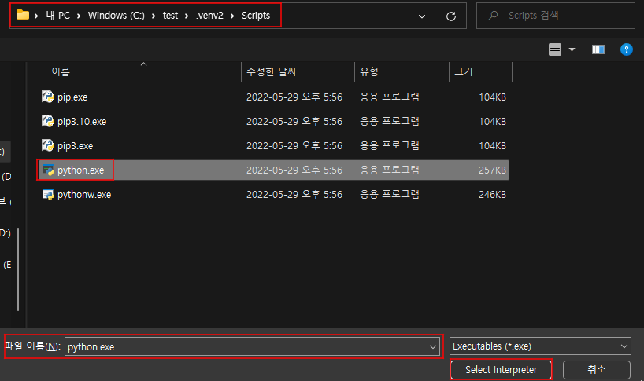
   
6. ctrl + shift + \`
    
   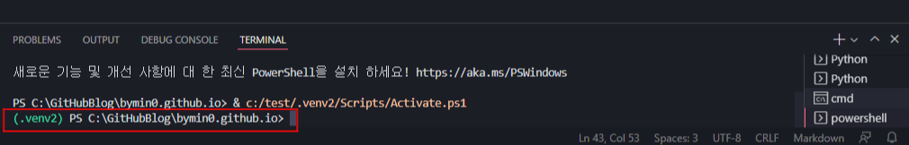
    
   사진과 같이 `(가상환경이름) root>`가 나오면 가상환경 실행 성공!