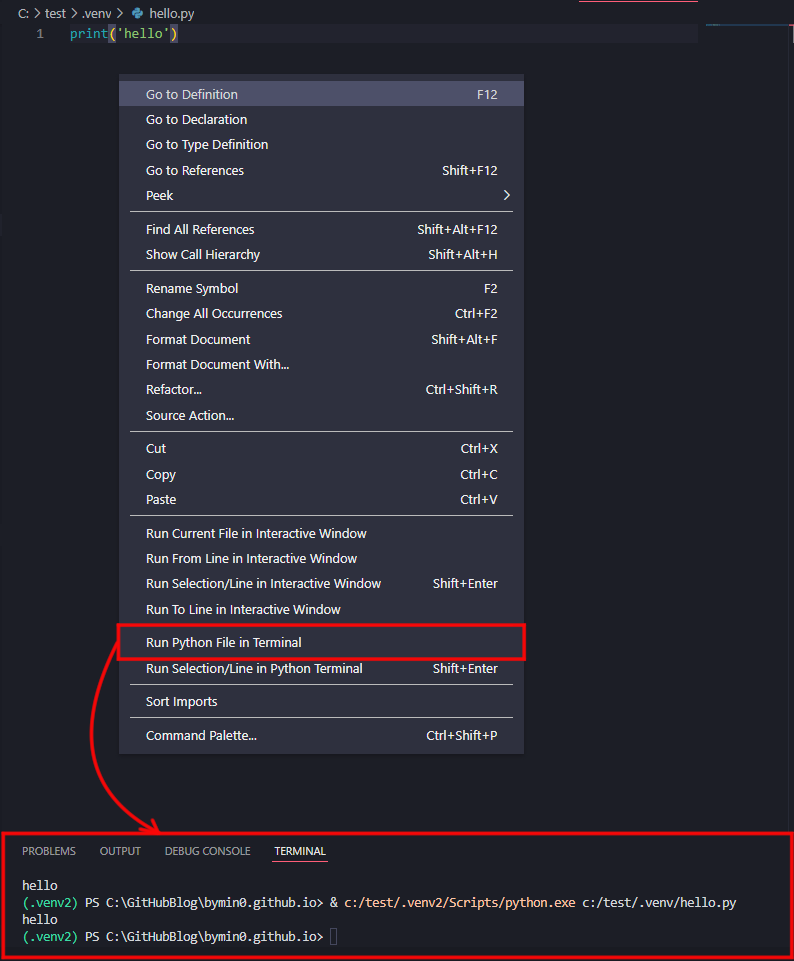

# 라이브러리란?
- 필요한 코드들을 미리 만들어 저장한 함수 집합체
- C언어의 `#include <stdio.h>`와 같이 라이브러리를 불러와서 사용할 수 있다.

# 라이브러리 사용하기
- 기본적으로 제공하고 있는 라이브러리 : [표준 라이브러리(3.10.4)](https://docs.python.org/ko/3/library/index.html)
- 라이브러리 호출 : `import library_name`
- 라이브러리를 호출하지 않고 사용하는 함수(ex - len(), max(), int(), ... )들은 [내장함수](https://docs.python.org/ko/3/library/functions.html)라고 불린다.

# 라이브러리 설치
- 기본적으로 설치되어있는 라이브러리 이외에도 다른 라이브러리들이 존재한다.
- [pypig.org](https://pypi.org/)에 파이썬에 설치 가능한 외장 라이브러리들의 정보가 있으니, 필요한 라이브러리이름을 찾을 수 있다.
- 예시) numpy라는 외장 모듈 검색
  <br>
  
  <br>
  

- 라이브러리 설치 w. vs code
  - 가상환경으로 파이썬 터미널을 연 것과 같이 [파이썬 터미널 열기](https://bymin0.github.io/posts/python_%EA%B0%80%EC%83%81%ED%99%98%EA%B2%BD/)
  <br>
  

  - 터미널에 라이브러리 설치 코드 실행 : `pip install numpy`
  <br>
  

- 라이브러리 설치 w. cmd
  - win + R
  - cmd
  - python 입력
    <br>
    
  - numpy 설치
    <br>
    

# 라이브러리 사용 예시

```python
import numpy # numpy 라이브러리 불러오기

arr = numpy.array([[1,2,3],[4,5,6]]) # numpy의 array() 함수 사용
print(arr) # [[1 2 3] [4 5 6]]
print(type(arr)) # <class 'numpy.ndarray'>
```

## dir()
- 라이브러리의 모든 함수를 볼 수 있는 함수
- 사용 예시)
  <br>
  ```python
  dir(numpy)
  ```

  - 결과 : ['ALLOW_THREADS', 'AxisError', 'BUFSIZE', 'CLIP', 'ComplexWarning', 'DataSource', 'ERR_CALL', 'ERR_DEFAULT', 'ERR_IGNORE', 'ERR_LOG', 'ERR_PRINT', 'ERR_RAISE', 'ERR_WARN',
  <br> ...
  <br>, 'unpackbits', 'unravel_index', 'unsignedinteger', 'unwrap', 'use_hugepage', 'ushort', 'vander', 'var', 'vdot', 'vectorize', 'version', 'void', 'void0', 'vsplit', 'vstack', 'warnings', 'where', 'who', 'zeros', 'zeros_like']

## 라이브러리 내부 모양
- 
- 본인이 직접 만들 수도 있음
- 하나의 파일만 만들 경우, `모듈`이라고 한다

## 직접 모듈 생성, 사용
1. 모듈 파일 생성
<br>

```python
# calc.py

def add(a, b) :
    return a + b

def sub(a, b) :
    return a - b

def mul(a, b) :
    return a * b

def div(a, b) :
    return a / b
```

2. 같은 경로의 새 파일 생성
- 

3. 직접 만든 모듈 import
<br>

```python
# hello.py

import calc

num = calc.add(10,11)
print(num) # 21
```